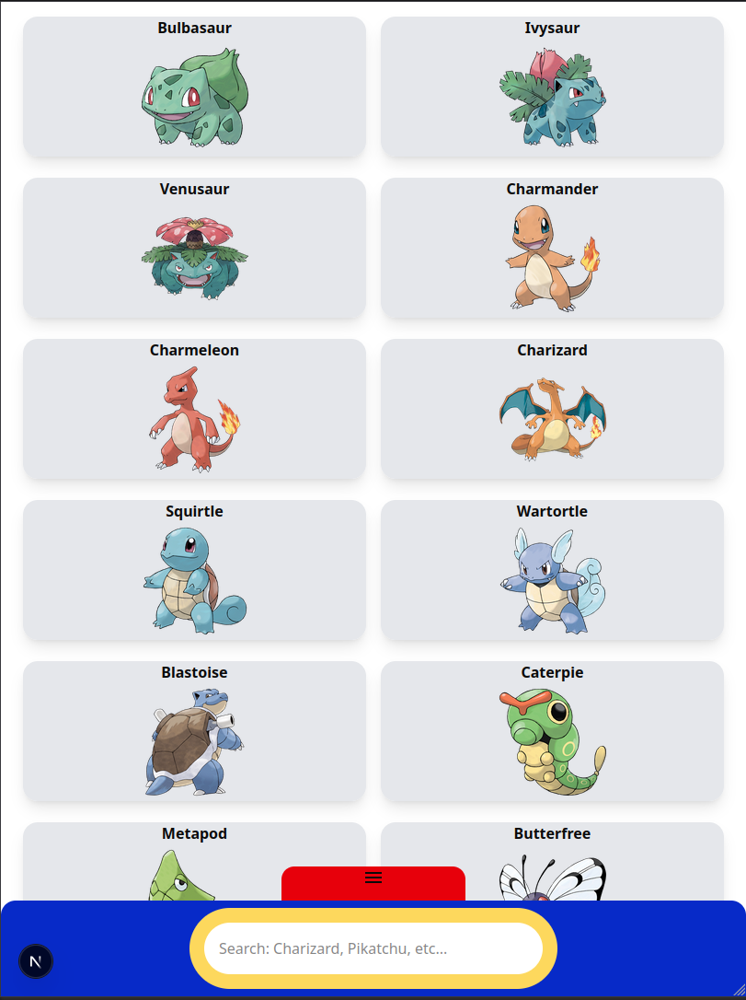
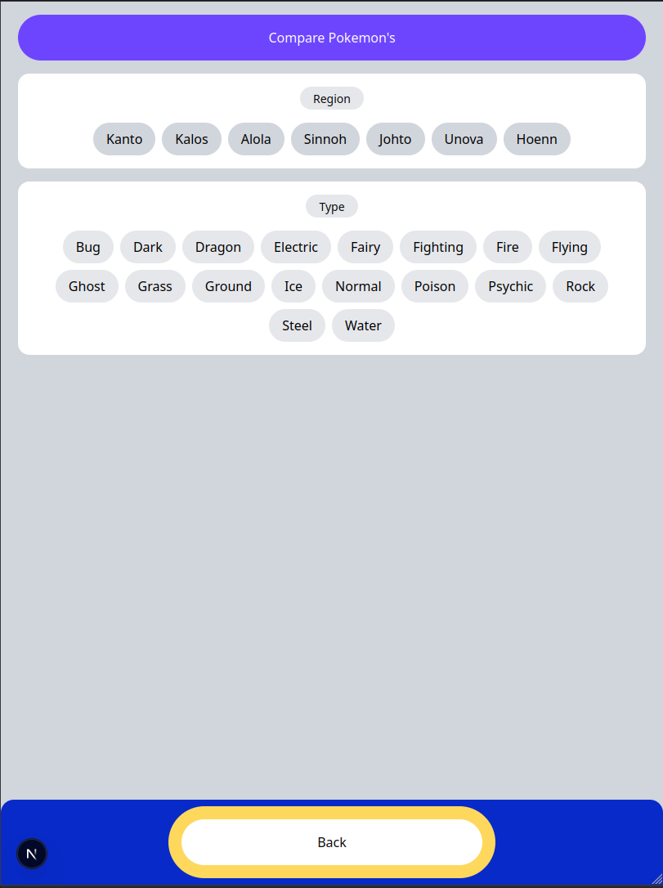
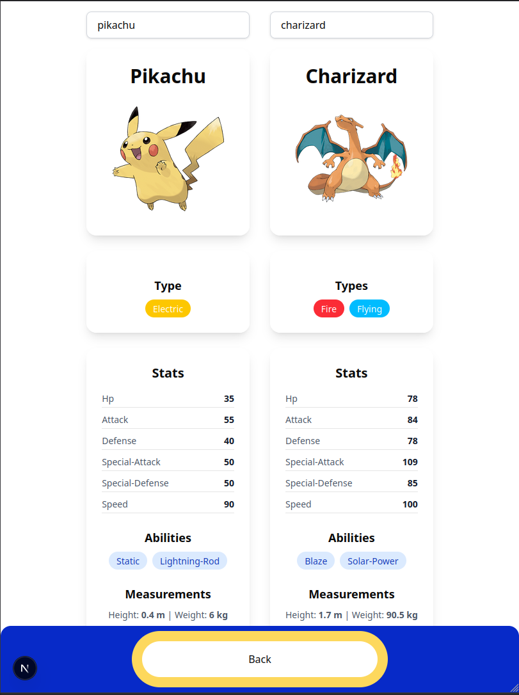
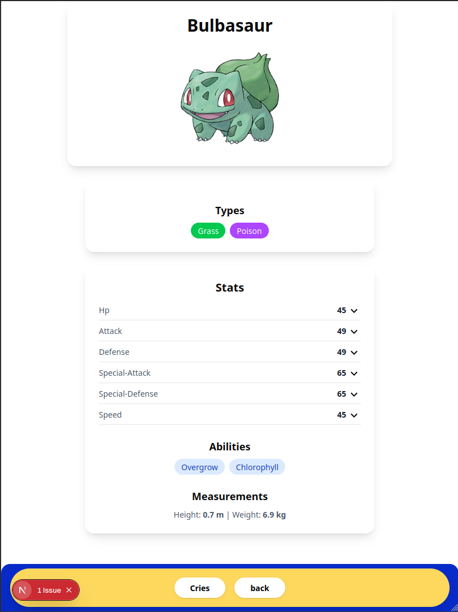
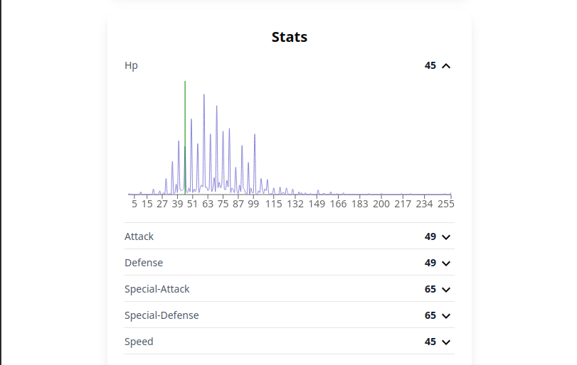
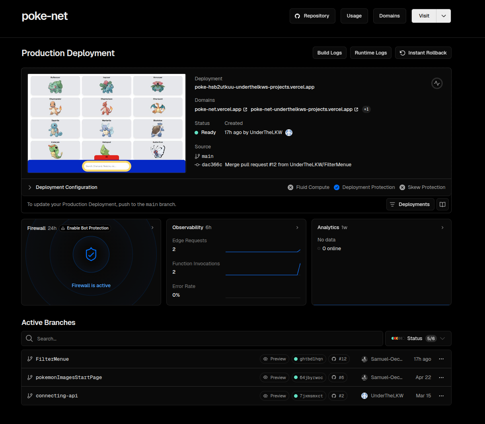
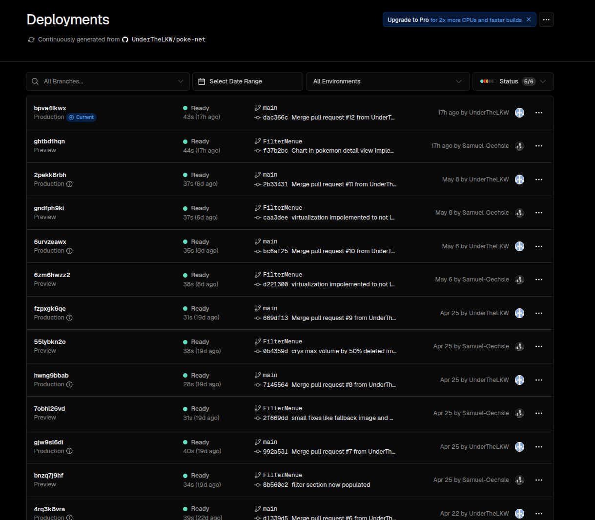

## Introduction

This is a [Next.js](https://nextjs.org) project bootstrapped with [`create-next-app`](https://nextjs.org/docs/app/api-reference/cli/create-next-app).

Project From Samuel Oechsle

## 📘 Project Description

This project is an interactive Pokédex built on top of the [PokéAPI](https://pokeapi.co/). Its goal is to deliver a responsive and high-performance frontend for exploring, filtering, and comparing Pokémon.  

Users can browse Pokémon by name, type, or region, and view detailed information including types, stats, abilities, measurements, and evolution chains. The app also features a side-by-side Pokémon comparison tool.

This frontend challenge was created by **M.Lengl** and **M.Stühmer** to develop a suitable frontend for an already existing backend service.

---

## ⚙️ Tech Stack

- **Next.js** – React framework for SSR, CSR and SSG
- **Tailwind CSS** – Utility-first CSS framework
- **Axios** – HTTP client for calling REST and GraphQL endpoints
- **Recharts** – Data visualization
- **Vercel** – Deployment platform
- **GitHub** – Version control and collaboration
- **Recharts** - Chart

---

## 🚀 Installation Guide

### 1. Clone the repository

```bash
git clone https://github.com/UnderTheLKW/poke-net.git
cd poke-net
```

### 2. Install dependencies

```bash
npm install
# or
yarn install
```

### 3. Run the development server:

```bash
npm run dev
# or
yarn dev
# or
pnpm dev
# or
bun dev
```

### 4. Open localhost on port 3000

Open [http://localhost:3000](http://localhost:3000) with your browser to see the result.


This project uses [`next/font`](https://nextjs.org/docs/app/building-your-application/optimizing/fonts) to automatically optimize and load [Geist](https://vercel.com/font), a new font family for Vercel.


# Pokemon Service Utility

This module provides utility functions to fetch, cache, and manipulate Pokémon data using the [PokéAPI](https://pokeapi.co) and the beta [GraphQL API](https://beta.pokeapi.co/graphql/v1beta). It supports advanced querying for Pokémon stats, types, abilities, evolutions, and encounters.

---

## Features

- ✅ Caching with `axios-cache-interceptor` to reduce redundant API calls
- ✅ Recursive fetching of evolution chains
- ✅ GraphQL-based bulk data loading
- ✅ Error handling with retry logic
- ✅ In-memory performance optimization
- ✅ Virtualization for rendering Pokémon-List on needs
- ✅ Recharts for Chart in Pokémon-Detail-View

---

## Main view

Displays the main site of the Pokémon page.
on the Bottom is a Search-bar and a bit abowe the button to open a filter page.

### 📸 Screenshots


___

## Filter view

### 📄 File: `app/filter/page.tsx`

This is a **server-side React component** using Next.js 15 (`app/` directory). It calls `loadPokemonList()` to retrieve a full Pokémon list, then extracts and deduplicates:

- ✅ All available regions (`uniqueRegions`)
- ✅ All available types (`uniqueTypes`)


```tsx
const allRegions = pokemonList
        .flatMap(pokemonRegions => pokemonRegions.pokemon_v2_encounters.map(encounter => encounter.pokemon_v2_locationarea.pokemon_v2_location.pokemon_v2_region.name))
        .filter(Boolean);
    const uniqueRegions = Array.from(new Set(allRegions));

    const allTypes = pokemonList
        .flatMap(pokemon => pokemon.pokemon_v2_pokemontypes.map(pokemonType => pokemonType.pokemon_v2_type.name))
        .filter(Boolean);
    const uniqueTypes = Array.from(new Set(allTypes)).sort();

```

---

### 🔧 Functionality

- **Compare Button**  
  A link that navigates to the `/compare` page.

- **Region Filter**  
  Extracts region names from encounter data and displays each as a button.

- **Type Filter**  
  Extracts all Pokémon types and renders them as filterable buttons.

- **Back Button**  
  Provided inside the `Button` component to return to the home page.

---

### 🗂️ Filter by Region or Type

Users can filter Pokémon by their origin region or type.

### 📸 Screenshots



---

### 🔍 Compare View

Displays two Pokémon side by side with stats, abilities, and measurements.

### 📸 Screenshots




---

## Components

### `PokemonCard`

A simple, reusable component that displays a Pokémon's **name** and **official artwork** as a clickable card. Used for navigation or display in lists, grids, or evolution chains.

---

### 🆚 `PokemonCompare` Component

The `PokemonCompare` component renders a side-by-side comparison of two Pokémon, showing their **stats**, **types**, **abilities**, **images**, and **measurements**.

---

### 🔊 `PokemonCry` Component

The `PokemonCry` component plays the **cry (sound effect)** of a Pokémon when clicked. It's a reusable button that triggers the audio based on the Pokémon’s numeric ID.

---


### 🧱 `PokemonGrid` Component

The `PokemonGrid` component displays a **filterable**, **searchable**, and **virtualized** grid of Pokémon using dynamic column layout and responsive design. It combines `@tanstack/react-virtual` for performance and Tailwind CSS for styling.

---

### 🔎 `SearchBar` Component

The `SearchBar` is a **fixed-position input container** designed to anchor to the bottom of the screen and its for the Pokémon search functionality. It include a button to navigate to the filter page.

---

### 🧭 Dynamic Compare Page Route

This page dynamically compares two Pokémon based on the URL using Next.js App Router's **dynamic segments**.

---

## 📊 `PokemonOverallChart` Component

The `PokemonOverallChart` component renders a **line chart** that visualizes how a given Pokémon's stat (like HP, Attack, or Speed) compares to all other Pokémon. It uses `recharts` to show the distribution of stat values and highlights the selected Pokémon’s value.

---

## 📈 `PokemonStat` Component

The `PokemonStat` component displays a single Pokémon stat (e.g., HP, Attack, Speed) and reveals a comparison chart when clicked. It allows users to understand how the selected Pokémon compares to others in the same stat category.

---

## 🔍 Pokémon Detail Page

This route displays full details about a single Pokémon, including its image, types, stats, abilities, measurements, chart and evolution chain. It also features audio playback of the Pokémon's cry.

### 📸 Screenshots



By clicking on the arrow down opens a chart with a view of all Pokémons stat and the green a line for the actual Pokémon.



---

## 🌐 Vercel

This project is deployed using **[Vercel](https://vercel.com/)** — a fast, developer-friendly platform for hosting modern web applications with built-in support for **Next.js**, serverless functions, and automatic deployments from GitHub.
Check out our [Next.js deployment documentation](https://nextjs.org/docs/app/building-your-application/deploying) for more details.

### 📸 Screenshots

Overview of the project on Vercel



Some Pipeline runs after merging on main



---

## 🧠 Future Features

1. Show strengths/weaknesses vs other types (e.g., Fire > Grass).
2. Mark Pokémon as favorites.
3. Let users "mark as caught"
4. Dark Mode Toggle
5. Translate the UI and Pokémon species names into multiple languages

---

## Learn More

To learn more about Next.js, take a look at the following resources:

- [Next.js Documentation](https://nextjs.org/docs) - learn about Next.js features and API.
- [Learn Next.js](https://nextjs.org/learn) - an interactive Next.js tutorial.

You can check out [the Next.js GitHub repository](https://github.com/vercel/next.js) - your feedback and contributions are welcome!


